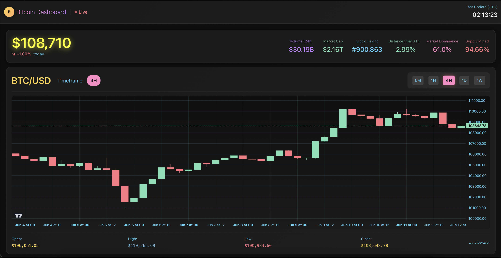

# Liberator Stream: Bitcoin Live Dashboard

```
██████╗ ████████╗ ██████╗      ██████╗  █████╗ ███████╗██╗  ██╗
██╔══██╗╚══██╔══╝██╔════╝      ██╔══██╗██╔══██╗██╔════╝██║  ██║
██████╔╝   ██║   ██║     █████╗██║  ██║███████║███████╗███████║
██╔══██╗   ██║   ██║     ╚════╝██║  ██║██╔══██║╚════██║██╔══██║
██████╔╝   ██║   ╚██████╗      ██████╔╝██║  ██║███████║██║  ██║
╚═════╝    ╚═╝    ╚═════╝      ╚═════╝ ╚═╝  ╚═╝╚══════╝╚═╝  ╚═╝
```

## [btc-dash.com](https://btc-dash.com)



This project is a real-time Bitcoin dashboard that streams live data to a web interface with intelligent **multi-source API architecture**. It provides comprehensive Bitcoin information with live price updates, historical chart data, and key blockchain metrics. The dashboard features automatic API rotation, fallback mechanisms, and memory-efficient operation for 24/7 deployment.

## Project Overview

The application provides a live dashboard with the following features:

- **Real-time Price Updates**: Live Bitcoin price updates streamed directly to the dashboard with automatic API source rotation
- **Historical OHLC Data**: Interactive charts displaying Open, High, Low, and Close (OHLC) data across multiple timeframes (5M, 1H, 4H, 1D, 1W)
- **Key Blockchain Metrics**: Displays critical blockchain information, including current block height, market dominance, and total supply
- **Dynamic Timeframe Rotation**: The backend automatically rotates through different timeframes, providing a comprehensive view of the market
- **Multi-Source API Management**: Intelligent rotation between multiple data sources (CoinGecko, CoinCap, Binance, Blockstream) with automatic failover
- **Memory-Efficient Operation**: Built for long-running deployment with automatic memory cleanup and overflow protection
- **Comprehensive Monitoring**: Real-time system health monitoring with detailed API adapter status

## Architecture

The project uses a **unified architecture** where a single Node.js backend serves both API endpoints and the React frontend as static files, while intelligently managing multiple data sources for maximum reliability.

### Frontend

The frontend is a single-page application built with **React**. It uses:

- **Chakra UI**: For a clean and modern user interface.
- **Lightweight Charts**: To render interactive financial charts.
- **WebSockets**: To receive real-time data from the backend.

### Backend

The backend is a **Koa.js** application with intelligent API management that serves four primary purposes:

1.  **Multi-Source Data Aggregation**: Uses multiple API adapters with automatic rotation and failover:
    - **CoinGecko**: Primary source for market data, OHLC information, and global metrics
    - **CoinCap**: Alternative market data source with fast response times
    - **Binance**: High-frequency OHLC data source
    - **Blockstream**: Dedicated blockchain metrics (block height, network data)
2.  **Smart Caching Layer**: Centralized cache service that validates and stores data from multiple sources
3.  **Real-time Streaming**: WebSocket server pushes aggregated data to all connected clients with efficient memory management
4.  **Static File Serving**: Serves the built React application as static files with proper routing

### API Routes

The backend exposes comprehensive monitoring and data endpoints:
- `/api/health` - System health check with architecture info
- `/api/stats` - Comprehensive scheduler and cache statistics  
- `/api/memory` - Real-time memory usage and system metrics
- `/api/adapters` - API adapter health status and performance metrics
- `/api/cache` - Current cached data for debugging
- `/api/admin/cleanup` - Manual memory cleanup trigger
- `/` - Serves the React application (catch-all for client-side routing)

### Multi-Source API Architecture

The system features intelligent API management:

- **Adaptive Rotation**: Automatically cycles between API sources to prevent rate limiting
- **Fallback Mechanisms**: Seamlessly switches to alternative sources when primary APIs fail
- **Memory Management**: Automatic cleanup with overflow protection for 24/7 operation
- **Health Monitoring**: Real-time tracking of adapter performance and automatic recovery
- **Centralized Configuration**: Single source of truth for timeframes and API settings

## Tech Stack

| Area            | Technology                               |
| --------------- | ---------------------------------------- |
| **Frontend**    | React, Chakra UI, Lightweight Charts     |
| **Backend**     | Koa.js, WebSockets (`ws`), Axios, koa-static |
| **API Sources** | CoinGecko, CoinCap, Binance, Blockstream |
| **DevOps**      | Docker, Docker Compose                   |
| **Deployment**  | Render (unified deployment)             |
| **Testing**     | Jest, React Testing Library              |
| **Linting**     | ESLint, Prettier                         |

## Quick Start

### Using Make (Recommended)

```bash
# Install all dependencies
make install

# Run in development mode (hot reload)
make dev

# Build and run in production mode
make build
make start
```

### Manual Setup

1.  **Clone the repository:**
    ```bash
    git clone https://github.com/your-username/liberator-stream.git
    cd liberator-stream
    ```

2.  **Install dependencies and build:**
    ```bash
    npm install
    npm run build
    ```

3.  **Start the application:**
    ```bash
    npm start
    ```

4.  **Access the application and monitoring:**
    - **Application**: [http://localhost:3001](http://localhost:3001)
    - **System Stats**: [http://localhost:3001/api/stats](http://localhost:3001/api/stats)
    - **API Health**: [http://localhost:3001/api/adapters](http://localhost:3001/api/adapters)
    - **Memory Usage**: [http://localhost:3001/api/memory](http://localhost:3001/api/memory)

### Development Mode

For development with hot-reload:

```bash
make dev
# or
npm run dev
```

### Development with Docker Compose

```bash
make docker-up
# or
docker-compose up --build
```

Access the application:
- **Frontend**: [http://localhost:3000](http://localhost:3000)
- **Backend Health Check**: [http://localhost:3001/api/health](http://localhost:3001/api/health)

## Development and Testing

### Development Commands

```bash
# Development with hot reload
make dev

# Production mode
make start

# Linting
make lint

# Format code
make format
```

### Testing

```bash
# Run all tests
make test

# Backend tests only
make test-backend

# Frontend tests only
make test-frontend

# Watch mode (backend)
cd backend && npm run test:watch
```

### Monitoring and Debugging

The application provides comprehensive monitoring:

**System Health:**
- `/api/health` - Basic system status
- `/api/stats` - Detailed scheduler and cache statistics
- `/api/memory` - Memory usage and system metrics

**API Management:**
- `/api/adapters` - Health status of all API adapters
- `/api/cache` - Current cached data for debugging

**Administration:**
- `/api/admin/cleanup` - Manual memory cleanup trigger


## Project Structure

```
liberator-stream/
├── backend/
│   ├── src/
│   │   ├── adapters/       # API adapters (CoinGecko, CoinCap, Binance, Blockstream)
│   │   ├── cache/          # Centralized caching system
│   │   ├── config/         # Configuration management
│   │   ├── services/       # Business logic services
│   │   ├── websocket/      # WebSocket server implementation
│   │   ├── __tests__/      # Test suites
│   │   └── app.js          # Main Koa application
│   ├── Dockerfile
│   └── package.json
├── frontend/
│   ├── src/
│   │   ├── components/     # React components
│   │   ├── theme/          # Chakra UI theme
│   │   ├── __tests__/      # Test suites
│   │   └── App.js          # Main application component
│   ├── build/              # Production build output (created by make build)
│   ├── Dockerfile
│   └── package.json
├── Makefile                # Development commands
├── package.json            # Root package.json for unified builds
├── docker-compose.yml      # Docker Compose configuration
├── CLAUDE.md               # Claude Code development guidance
└── README.md
```

## How It Works

### Multi-Source Architecture

The backend provides intelligent API management and memory optimization:

**Startup Process:**
1. **Initializes API Adapters**: Sets up multiple API sources with health monitoring
2. **Starts Cache Service**: Initializes centralized cache with memory management
3. **Serves React Application**: Static files served from `/frontend/build` directory
4. **Establishes WebSocket Connection**: Real-time data streaming to clients
5. **Fetches Initial Data**: Loads data from multiple sources with fallback
6. **Starts Scheduler**: Multiple update intervals for different data types

**Update Cycles with Intelligent Management:**
- **Market Data (30s)**: Rotates between CoinGecko → CoinCap → Binance
- **OHLC Data (60s)**: Rotates timeframes (5M → 1H → 4H → 1D → 1W) with source rotation
- **Blockchain Data (2min)**: Fetches from Blockstream with fallback
- **Global Data (5min)**: Market dominance and supply data from CoinGecko

**Memory Management:**
- Automatic counter overflow protection
- Periodic cleanup of historical data
- Bounded arrays with circular buffer behavior
- Real-time memory monitoring and reporting

**Fallback Mechanisms:**
- Automatic source switching on API failures
- Health monitoring with recovery detection
- Intelligent retry with exponential backoff
- Rate limiting to prevent API exhaustion

The frontend receives these WebSocket messages and updates the UI in real-time, providing a seamless live experience. The dynamic WebSocket URL ensures the connection works in both development and production environments.
